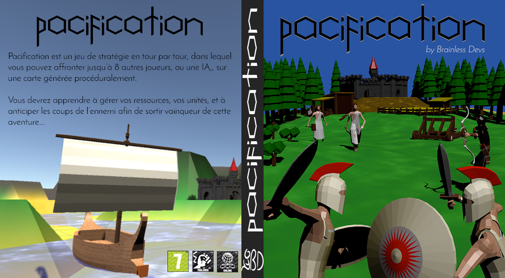

# Pacification

Pacification is a turn by turn strategy game, in which you face up to 8 players,
or an AI, on a procedurally generated map. You will need to learn how to handle
your own resources (mines, wood, food, etc.) and anticipate enemies actions to
come out a winner.

